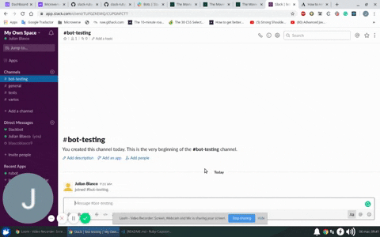
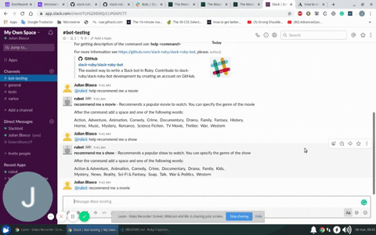
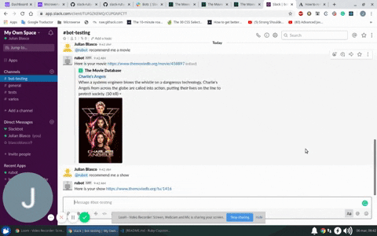

# Ruby Slack Bot 

> This is my Ruby capstone project from the Microverse curriculum

For this project I built a bot in Ruby that connects to the Slack API and The Movie Database API to give recommendations of movies and shows to watch

## Built With

- Ruby
- slack-ruby-bot
- celluloid-io

## Getting Started

To get a local copy up and running follow these simple example steps.

### Prerequisites

You will need to:
- Create a Slack workspace [here](https://slack.com/create#email)
- Have a Slack API Token. You can get one by creating an app [here](http://slack.com/services/new/bot)
- Have a TMDB API Key. First, register [here](https://www.themoviedb.org/account/signup) if you don't already have an account, then follow [these](https://developers.themoviedb.org/3/getting-started/introduction) instructions

To complete the installations you should have installed:
- Ruby
- Bundler

### Install

- Download or clone the project

- Then to install all the dependencies run

  `bundle install `

### Usage

To start using the bot you'll need to create a file named .env in the root folder and paste the following inside 

`export SLACK_API_TOKEN=<your token>
TMDB_API_KEY=<your key>`

Once you have done that you can run it by typing

`bundle exec ruby bin/main.rb`

After the bot is runing you can invite it to your channel

## Commands

### help

### recommend me a movie / recommend me a show

### recommend me a movie (genre) / recommend me a show (genre)

## Authors

👤 **Julian Blasco**

- Github: [@Blasco9](https://github.com/Blasco9)
- Linkedin: [Julian Augusto Blasco](https://www.linkedin.com/in/julian-augusto-blasco-1656a0153/)

## 🤝 Contributing

Contributions, issues and feature requests are welcome!

Feel free to check the [issues page](issues/).

## Show your support

Give a ⭐️ if you like this project!

## Acknowledgments

This project was possible thanks to The Movie Database API and the creator of the Slack Ruby Bot gem

## 📝 License

This project is [MIT](lic.url) licensed.
